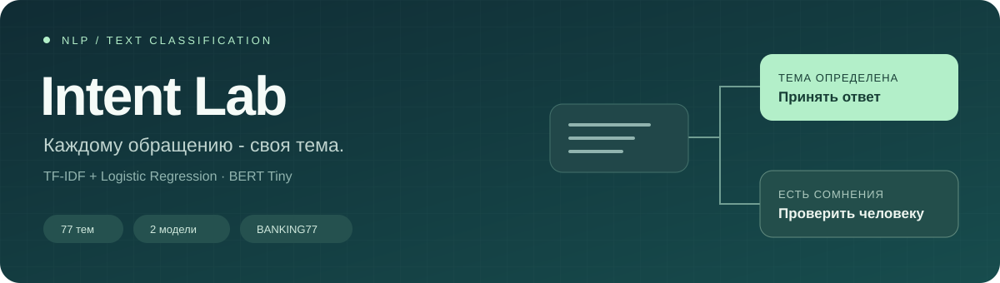

<p align="center">
  
</p>

<p align="center">
  <a href="#результаты">Результаты</a> ·
  <a href="notebooks/01_experiment.ipynb">Ноутбук</a> ·
  <a href="#как-запустить">Запуск</a> ·
  <a href="reports/SUMMARY.md">Отчёт</a>
</p>

# Intent Lab

**Определение темы банковского обращения с проверкой уверенности.**

Приложение читает сообщение клиента и определяет, с чем он обратился в банк: потерял карту, не получил перевод, хочет снять наличные или столкнулся с другой проблемой. Всего есть 77 тем. Если модель недостаточно уверена в ответе, приложение предлагает передать сообщение человеку.

### Пример

> My card was stolen. How can I block it?

Ожидаемая тема: **`lost_or_stolen_card`** - потеря или кража карты.

```text
Сообщение клиента
       |
  Классификатор
       |
  Проверка уверенности
       |
       +--> Оценка выше порога: принять тему
       +--> Оценка ниже порога: передать человеку
```

**Стек:** Python · scikit-learn · PyTorch · Transformers · Streamlit

> **Язык данных:** английский. Работа с русскими обращениями не проверялась.

## Польза для бизнеса

Проект сокращает ручную сортировку обращений и освобождает время сотрудников. Размер экономии зависит от объёма сообщений, времени обработки и качества модели на данных компании.

## Что сделано

- Взял набор банковских обращений BANKING77 и убрал повторяющиеся сообщения из обучающих данных.
- Разделил данные на части для обучения, выбора настроек, подбора порога уверенности и итоговой проверки.
- Обучил две модели: TF-IDF + Logistic Regression и BERT Tiny.
- Для первой модели подобрал настройки классификатора. Для BERT сравнил две скорости обучения и сохранял вариант, который лучше справлялся с проверочными сообщениями.
- Подобрал порог, ниже которого ответ модели нужно проверить человеку.
- Сравнил результаты, разобрал ошибки и сделал простой интерфейс на Streamlit.

TF-IDF использует слова и сочетания символов как признаки для классификации. BERT Tiny - небольшая предобученная нейросеть, которую я дополнительно обучил на банковских обращениях.

## Результаты

Модели проверены на 3 080 сообщениях, которые не использовались для обучения.

| Метрика | TF-IDF + Logistic Regression | BERT Tiny |
|---|---:|---:|
| Правильные ответы на всём тесте | **90,13%** | 88,15% |
| Macro-F1 | **0,9014** | 0,8815 |
| Доля сообщений, принятых автоматически | 87,73% | 85,52% |
| Правильные ответы среди принятых автоматически | 95,63% | 94,91% |

Macro-F1 показывает качество по всем категориям, давая каждой одинаковый вес. Чем ближе значение к 1, тем лучше.

TF-IDF оказался немного точнее. BERT после настройки тоже показал хороший результат: его macro-F1 вырос с 0,507 до 0,881. Для сравнения использован тот же тестовый набор, что и в первом запуске. Настройки выбирались по отдельным проверочным данным.

Подробности и примеры ошибок - в [отчёте](reports/SUMMARY.md) и [ноутбуке](notebooks/01_experiment.ipynb).

## Как выбирается порог

Для каждого сообщения модель выдаёт оценки возможных тем. Мы берём самую высокую оценку и сравниваем её с порогом. Если оценка ниже порога, сообщение нужно проверить человеку.

Порог подбирается на отдельной части данных. Цель - принимать как можно больше сообщений, сохраняя не менее 95% правильных ответов среди принятых. При подборе учитываются только варианты, в которых принято хотя бы 50 сообщений. Если подходящего порога нет, все сообщения передаются человеку.

На новых данных точность может быть ниже. Например, у BERT на тесте получилось 94,91%, хотя при подборе порога было больше 95%.

## Данные

Использован [BANKING77 от PolyAI](https://github.com/PolyAI-LDN/task-specific-datasets): 10 003 сообщения для обучения и 3 080 для тестирования. Все сообщения на английском языке. После очистки обучающая часть дополнительно разделена для выбора настроек и порога.

Источник: Casanueva и соавторы, [Efficient Intent Detection with Dual Sentence Encoders](https://arxiv.org/abs/2003.04807), 2020. Лицензия данных - CC BY 4.0.

Исходная нейросеть - [BERT Tiny](https://huggingface.co/prajjwal1/bert-tiny).

## Как запустить

Команды для PowerShell. Проверенное окружение - Python 3.14.

**1. Скачайте проект**

```powershell
git clone https://github.com/alex-past-15/intent-classifier.git
cd intent-classifier
```

**2. Установите зависимости**

Создайте окружение и установите библиотеки:

```powershell
python -m venv .venv
.\.venv\Scripts\python.exe -m pip install -r requirements.txt
```

**3. Обучите модели**

Веса моделей не хранятся в репозитории. При первом запуске выполните обучение. Данные и исходная модель скачаются автоматически:

```powershell
.\.venv\Scripts\python.exe experiment.py --model all
```

**4. Запустите приложение**

```powershell
.\.venv\Scripts\python.exe -m streamlit run app.py --server.address 127.0.0.1 --server.port 8503
```

Откройте [localhost:8503](http://localhost:8503), выберите модель, введите сообщение на английском и нажмите «Определить тему».

<details>
<summary>Дополнительные команды и проверки</summary>

Для обучения только одной модели используйте `--model tfidf` или `--model bert`. После нового обучения обновите отчёт:

```powershell
.\.venv\Scripts\python.exe summarize.py
```

Проверки проекта:

```powershell
.\.venv\Scripts\python.exe -m unittest discover -s tests -v
```

</details>

## Что где находится

| Файл или папка | Назначение |
|---|---|
| `experiment.py` | Подготовка данных, обучение и оценка моделей |
| `predict.py` | Определение темы нового сообщения |
| `app.py` | Интерфейс приложения |
| `summarize.py` | Обновление итогового отчёта |
| `notebooks/01_experiment.ipynb` | Просмотр данных, результатов и ошибок; само обучение находится в `experiment.py` |
| `reports/` | Метрики, предсказания и примеры ошибок |
| `data/` | Исходные данные и их разбиение |
| `artifacts/` | Исходная и обученные модели |
| `tests/` | Проверки работы проекта |
| `requirements.txt` | Библиотеки и их версии |
| `start.ps1` | Запуск приложения в Windows |

Данные и модели не включаются в Git. Чтобы обновить результаты в ноутбуке после обучения, выполните все его ячейки и сохраните файл.
